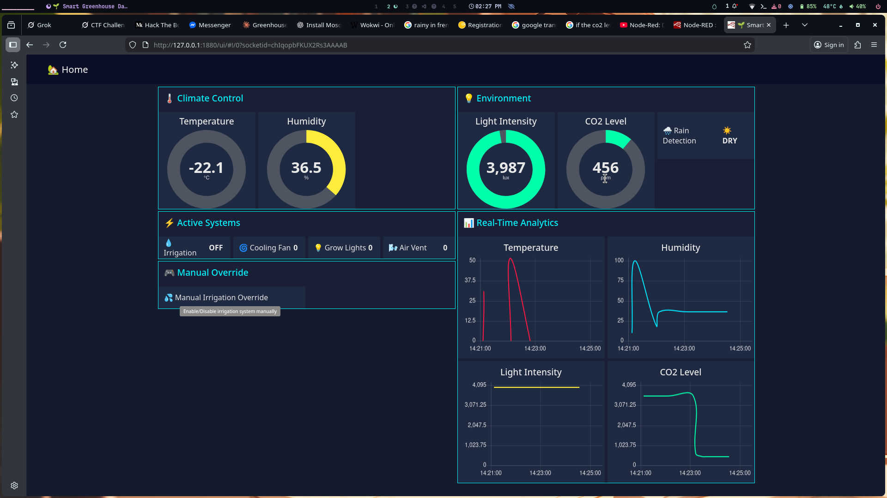
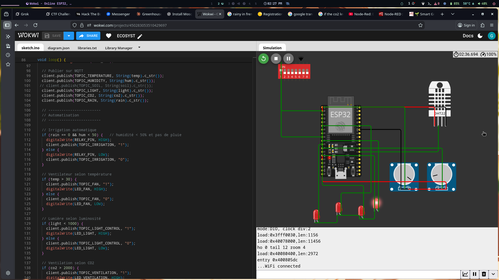
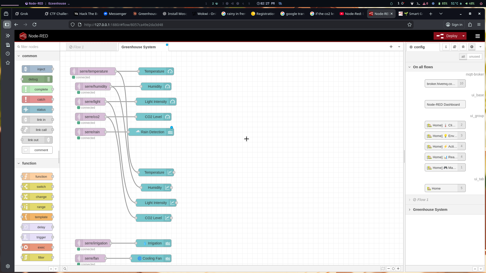

# 🌱 Système de Serre Intelligente IoT

Projet de surveillance et contrôle automatique d'une serre agricole utilisant ESP32, capteurs environnementaux et Node-RED.

## 📋 Description

Ce système permet de :
- 📊 Surveiller la température, humidité, luminosité et CO2 en temps réel
- 💧 Gérer l'irrigation automatique selon les conditions météo
- 🌀 Contrôler la ventilation et l'éclairage automatiquement
- 📈 Visualiser les données via un dashboard Node-RED
- 🔔 Déclencher des alertes en cas de conditions anormales

## 🏗️ Architecture du Système

### Matériel (ESP32)
- **Microcontrôleur** : ESP32
- **Capteurs** :
  - DHT22 (température et humidité)
  - Capteur de luminosité (analogique)
  - Capteur CO2 (analogique)
  - Détecteur de pluie (digital)
- **Actionneurs** :
  - Relais pour irrigation
  - LEDs indicateurs (ventilateur, éclairage, ventilation)

### Communication
- **Protocole** : MQTT
- **Broker** : HiveMQ (broker.hivemq.com:1883)
- **Topics** :
  - `serre/temperature`
  - `serre/humidity`
  - `serre/light`
  - `serre/co2`
  - `serre/rain`
  - `serre/irrigation`
  - `serre/fan`
  - `serre/lightControl`
  - `serre/ventilation`

## 🖼️ Captures d'écran

### Dashboard Node-RED


### Simulation Wokwi


### Configuration Node-RED


## 🚀 Installation

### 1. Configuration ESP32 (Wokwi)

```bash
cd ECOSYST
# Ouvrir le projet dans Wokwi
# Charger sketch.ino et diagram.json
```

### 2. Installation Node-RED

```bash
# Installer Node-RED (si ce n'est pas déjà fait)
npm install -g node-red

# Installer le dashboard
cd ~/.node-red
npm install node-red-dashboard

# Lancer Node-RED
node-red
```

### 3. Importer le Flow Node-RED

1. Ouvrir Node-RED : `http://localhost:1880`
2. Menu ≡ → Import → Clipboard
3. Copier le contenu de `node-red-style.json`
4. Cliquer sur Import
5. Déployer le flow

### 4. Accéder au Dashboard

Ouvrir dans le navigateur : `http://localhost:1880/ui`

## ⚙️ Configuration

### Paramètres WiFi (ESP32)
```cpp
const char* ssid = "Wokwi-GUEST";
const char* password = "";
```

### Seuils d'automatisation
```cpp
// Irrigation : humidité < 50% et pas de pluie
// Ventilateur : température > 30°C
// Éclairage : luminosité < 1000
// Ventilation : CO2 > 2000 ppm
```

## 📊 Fonctionnalités

### Automatisation
- ✅ **Irrigation intelligente** : Activation automatique si humidité basse et absence de pluie
- ✅ **Régulation thermique** : Ventilateur activé si température > 30°C
- ✅ **Gestion de l'éclairage** : Lumières activées si luminosité insuffisante
- ✅ **Qualité de l'air** : Ventilation activée si CO2 élevé

### Surveillance
- 📈 Graphiques temps réel (10 minutes d'historique)
- 🎯 Jauges avec indicateurs de seuils
- 🔴🟢 Indicateurs d'état ON/OFF pour chaque actionneur
- 🎮 Contrôle manuel de l'irrigation

## 📁 Structure du Projet

```
ecosystem-project/
├── ECOSYST/
│   ├── sketch.ino           # Code ESP32
│   ├── diagram.json         # Schéma Wokwi
│   ├── libraries.txt        # Dépendances
│   └── wokwi-project.txt    # Config Wokwi
├── node-red-style.json      # Flow Node-RED
├── dashboard.png            # Capture dashboard
├── simulation.png           # Capture simulation
├── node-red-config.png      # Capture config
└── README.md                # Ce fichier
```

## 🛠️ Technologies Utilisées

- **Hardware** : ESP32
- **Langage** : C++ (Arduino)
- **Communication** : MQTT
- **Visualisation** : Node-RED Dashboard
- **Simulation** : Wokwi
- **Bibliothèques** :
  - WiFi.h
  - PubSubClient.h
  - DHT.h

## 📝 Topics MQTT

| Topic | Type | Description |
|-------|------|-------------|
| serre/temperature | Publier | Température en °C |
| serre/humidity | Publier | Humidité en % |
| serre/light | Publier | Luminosité (0-4095) |
| serre/co2 | Publier | CO2 en ppm (0-4095) |
| serre/rain | Publier | Pluie détectée (0/1) |
| serre/irrigation | Pub/Sub | État irrigation (ON/OFF) |
| serre/fan | Publier | État ventilateur (ON/OFF) |
| serre/lightControl | Publier | État éclairage (ON/OFF) |
| serre/ventilation | Publier | État ventilation (ON/OFF) |

## 🔧 Dépannage

### ESP32 ne se connecte pas
- Vérifier les credentials WiFi
- Vérifier le broker MQTT

### Pas de données dans Node-RED
- Vérifier la connexion MQTT dans Node-RED
- S'assurer que l'ESP32 envoie des données (toutes les 5 secondes)

### Dashboard vide
- Installer `node-red-dashboard`
- Déployer le flow
- Rafraîchir la page du dashboard


